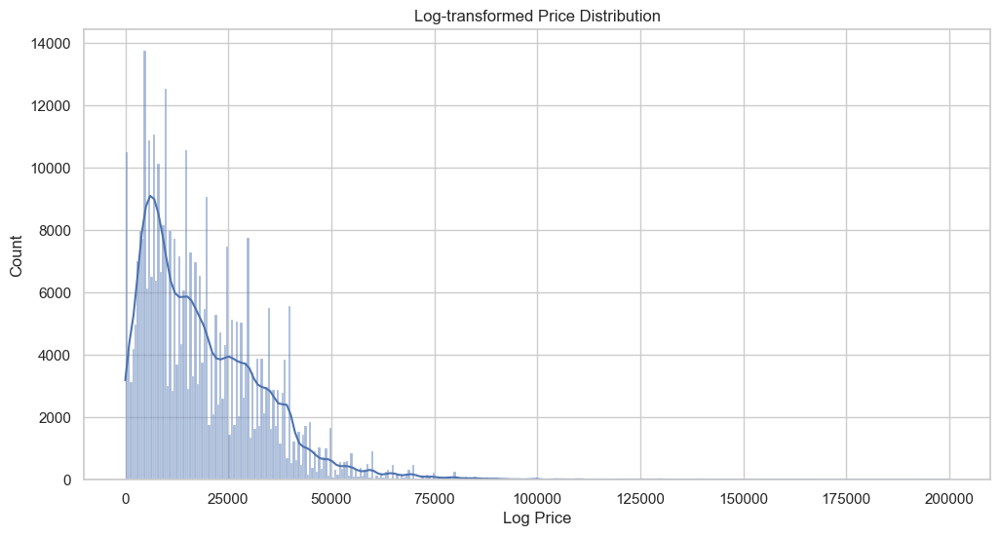
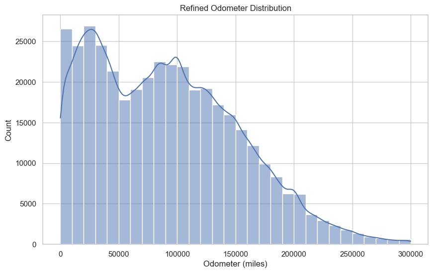
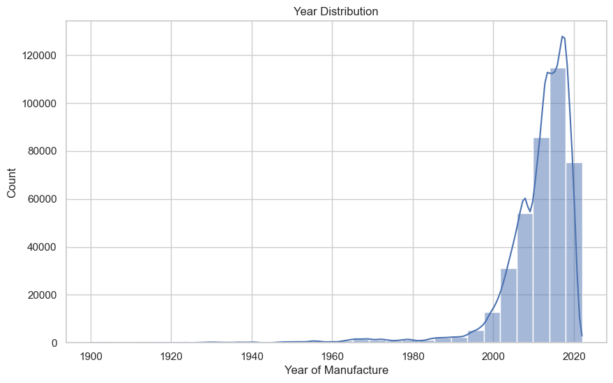
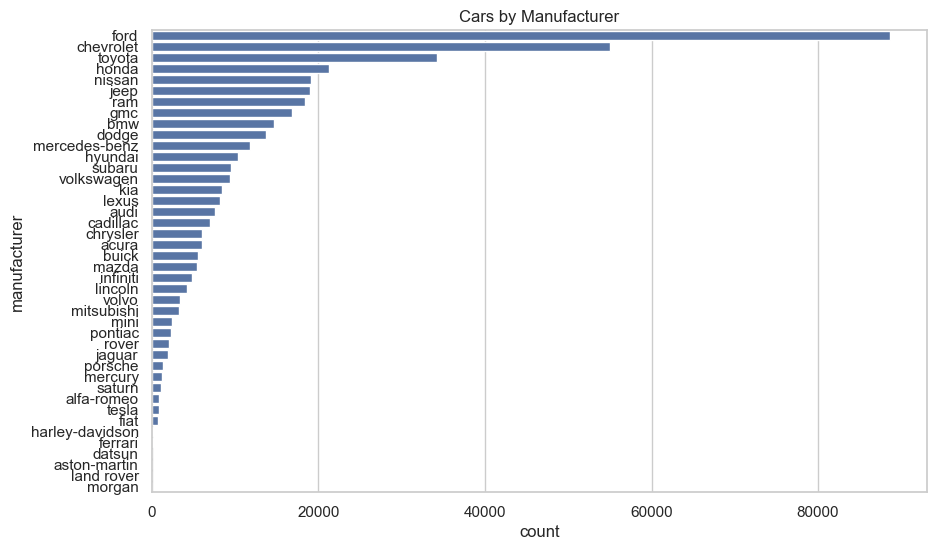
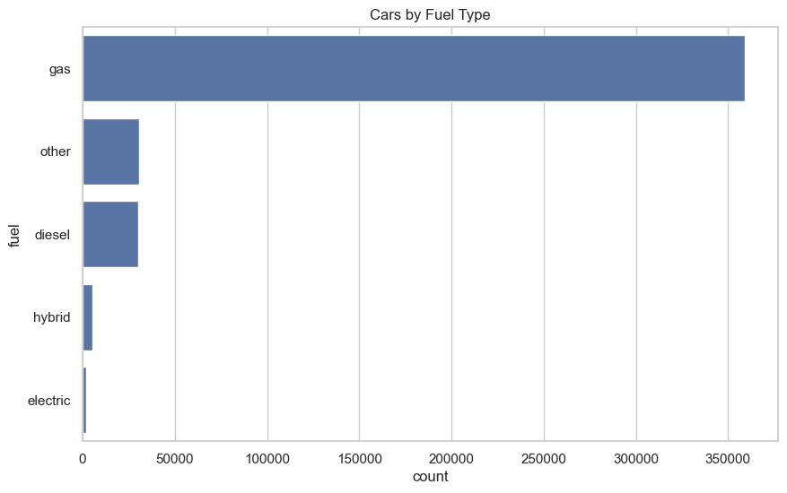
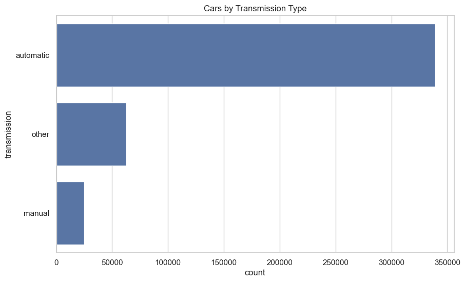
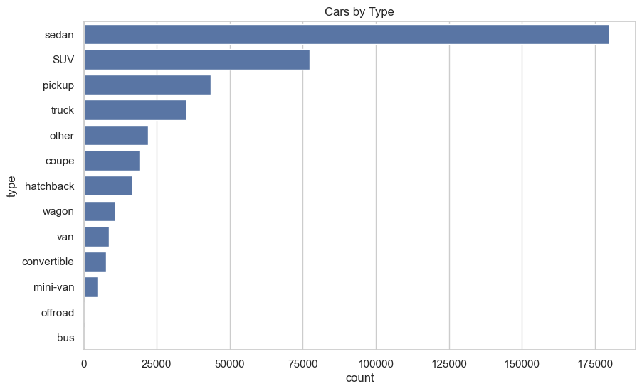
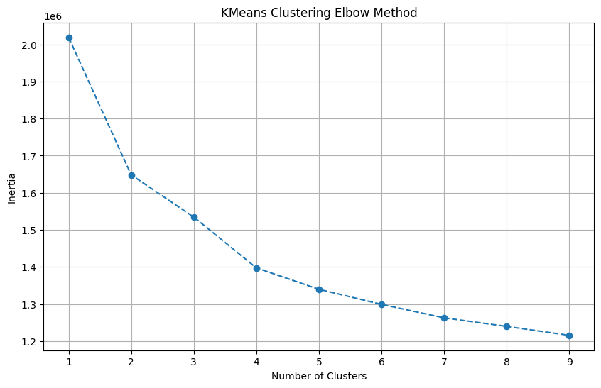
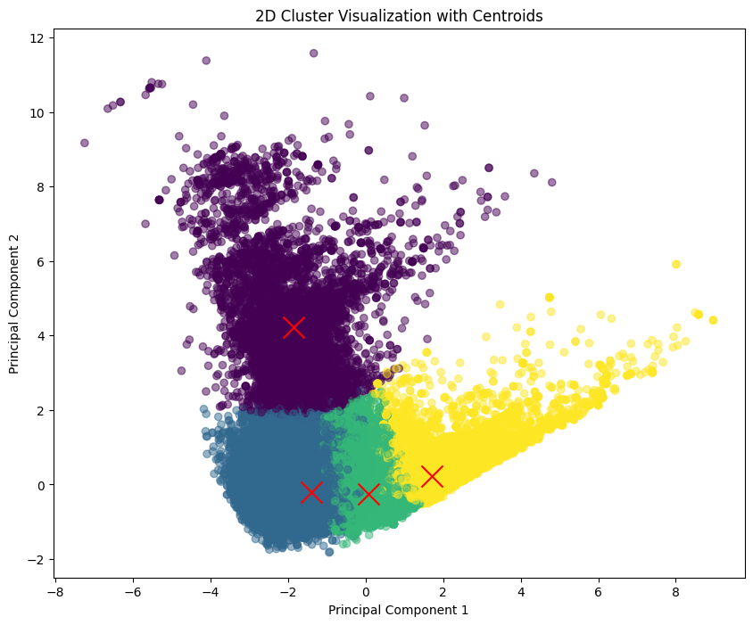
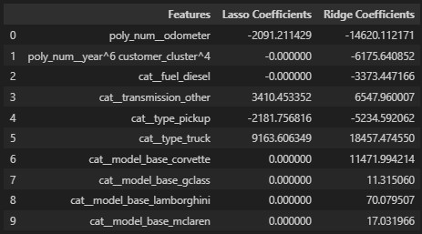

# UC Berekeley ML/AI Practical Assignment 2
## What drives the price of a car?

### Executive Summary: Insights into Used Car Valuation

#### Objective
The primary objective of this analysis was to identify key factors influencing the pricing of used cars, thereby enabling a used car dealership to optimize its inventory to align with consumer preferences and market demand.

#### Methodology
Leveraging the CRISP-DM framework, this study involved an extensive examination of a dataset comprising 426K used car listings. Two main analytical approaches were employed: (1) Lasso and Ridge regression models to understand the impact of various features on car prices, and (2) PCA + KMeans segmentation for customer behavior analysis.

#### EDA:
##### Numerical Distribution

- The price distribution is heavily right skews as expected due to supercar in the market that worth up to 3.7 mils. I decide to cap it at 300,000.

There are two things I can see from this distribution:
1. Right Skewed
2. Most common range:
    - 10,000 to 150,000 miles where services happening the most frequently

Consideration that higher mileage implies more wear and tear. Also be consider that the dealership will have a cut off point when selecting car with high odometer for their inventory as well!

- Manufacture a lot of cars in past two decades, this could mean that new cars are commonly resold.
- There is a decline of car before 1980 implication of fewer oldwer cars in the market, these car may yield higher price due to the collectible nature.
- For dealership, for the past 10 - 20 years are the sweet spot for inventory stocking. A lot in demand therefore manufacture.

##### Categorical Distribution

Four Insights from the Visualization:
1. Ford, Chevelet, and Toyota are top three purchased car
2. Most the car purchased are gas
3. Most people drive automatic cars
4. Top three most purchase car type are Sedan, SUV, and pickup

#### Segmentation Visualization:

- Around 150 n_component is optimal that capturing feature 95% variance.

- After four n_clusters, the number of cluster inertia start to flat out. So four appear to be the optimal clusters

There is a clear 4 distinct segmentation in the market. Even when I tried to increase to 5, the centroid on the bottom right overlapping, an indication that 4 number of clusters are quite optimal.

#### Key Findings

1. **Impact of Vehicle Features on Price:**

   - **Odometer Reading:** Vehicles with lower mileage command higher prices.
   - **Transmission Type:** Non-standard transmissions are associated with higher prices, indicating niche appeal.
   - **Vehicle Type:** Trucks and luxury vehicles, including brands like Corvette and G-Class, are highly valued.
   - **Fuel Type:** Diesel vehicles might be less preferred, potentially impacting their pricing negatively.

2. **Consumer Preferences and Segmentation:**

   - **Price Sensitivity:** Varies significantly across segments, with some customers prioritizing newer, low-mileage cars, and others showing interest in older, more affordable options.
   - **Brand and Model Preferences:** Preferences for Ford, Chevrolet, and luxury brands like Mercedes-Benz were observed, with significant variation across different customer segments.
   - **Vehicle Attributes:** Clean titles, automatic transmission, and gasoline fuel type are broadly preferred across all segments.

#### Recommendations

1. **Inventory Optimization:**
   - Prioritize acquisition of vehicles with lower mileage, automatic transmission, and clean title status.
   - Expand the range of luxury and performance vehicles, particularly for segments showing a preference for newer, high-end models.
   - Maintain a diversified inventory that includes trucks and vehicles with non-standard transmissions to cater to niche markets.

2. **Marketing and Sales Strategy:**
   - Develop targeted marketing campaigns highlighting the key selling points of luxury and performance vehicles for high-end market segments.
   - For price-sensitive segments, emphasize the value proposition of older models and vehicles with higher mileage, focusing on affordability and utility.
   - Use insights from customer segmentation to tailor sales approaches, ensuring alignment with the preferences and priorities of different market segments.

#### Conclusion
By aligning inventory and marketing strategies with the insights gained from the regression analysis and customer segmentation, the dealership can better meet consumer demands. Focusing on vehicles and features that are positively associated with higher prices—such as lower mileage, luxury branding, and specific vehicle types—can enhance the dealership's profitability and market positioning.# UC-Berkeley-ML-AI---Practical_assignment_1

##### P.S
- Please refer to my note for further detail in data cleaning, modelling, evaluation and insights.
